# Real time monitoring system for child abuse detection

## 개요

2021학년도 2학기 MEDICI+창업동아리의 결과물로, computer vision (CV) 기술을 활용하여 영상 속 사람의 표정을 실시간으로 분석하여 아동 복지 시설의 학대를 방지하기 위한 프로그램을 제작하고자 하였던 프로젝트이다.

## 발표자료

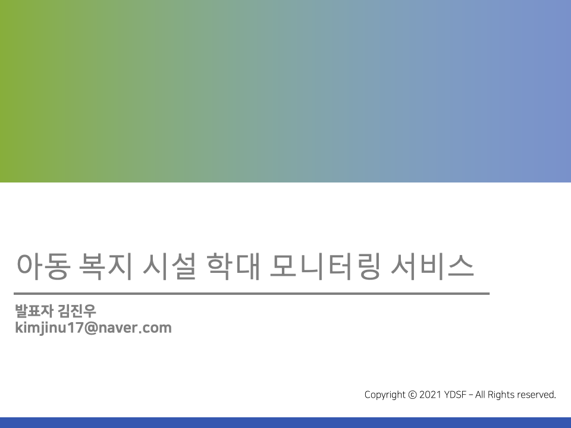

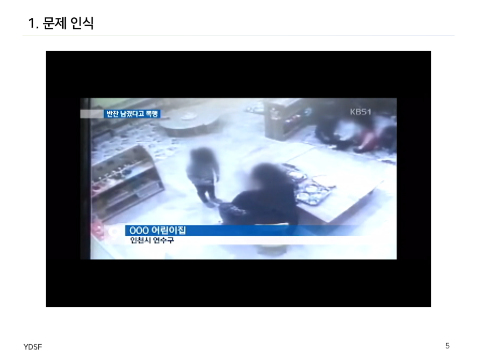

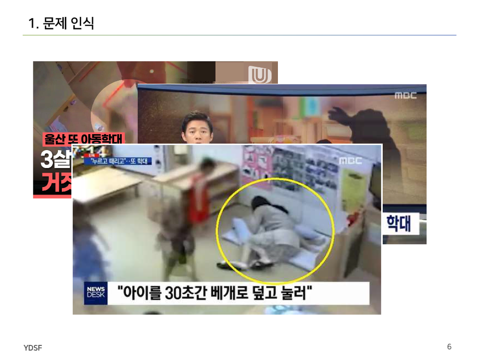

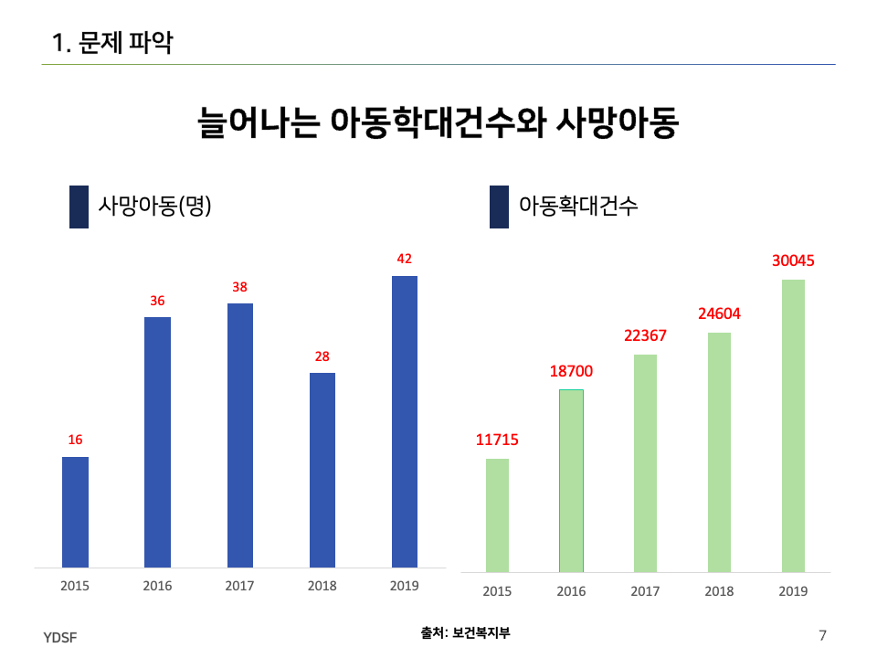

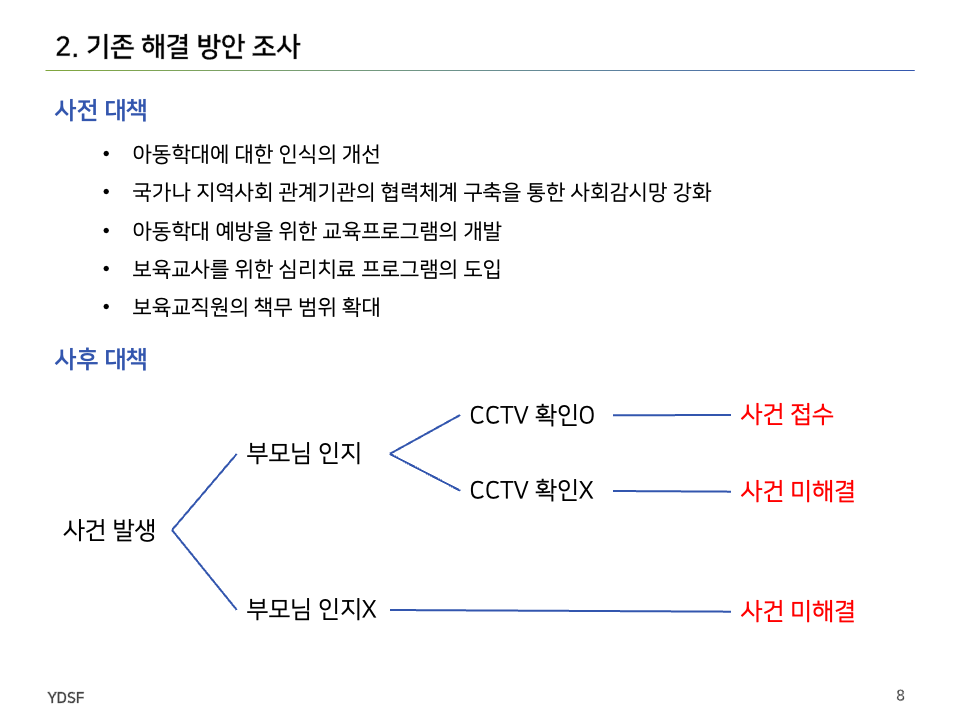

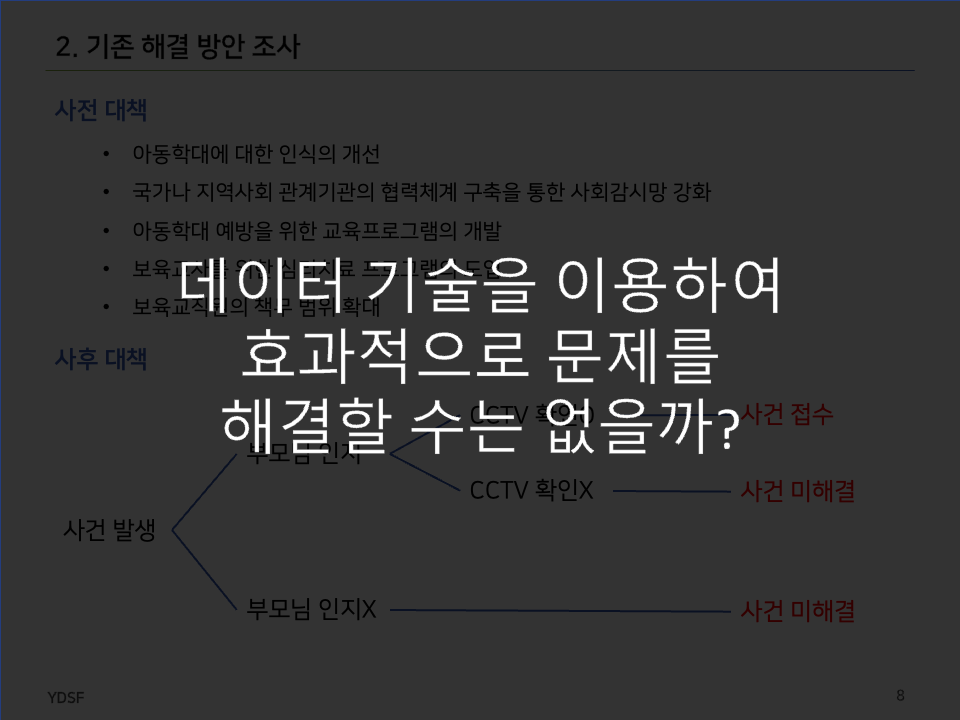

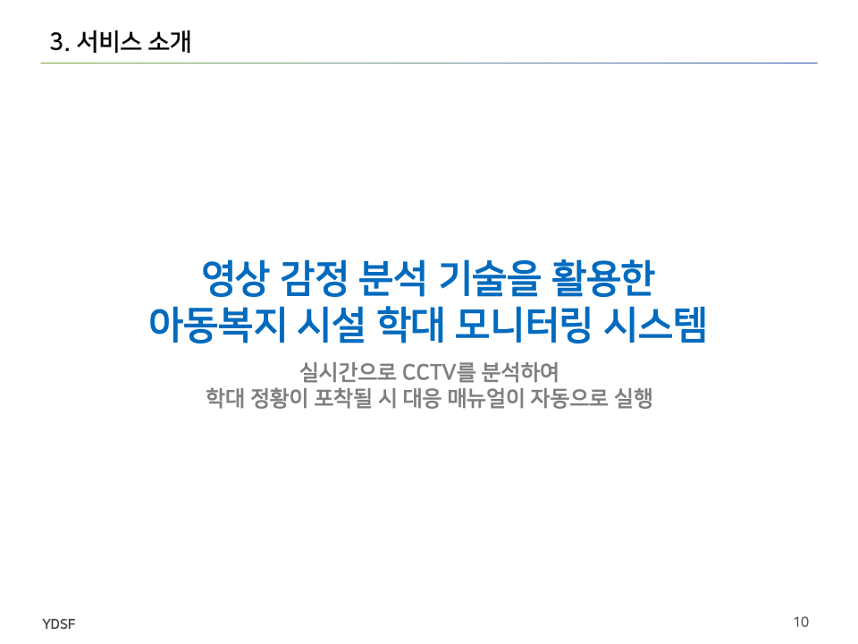

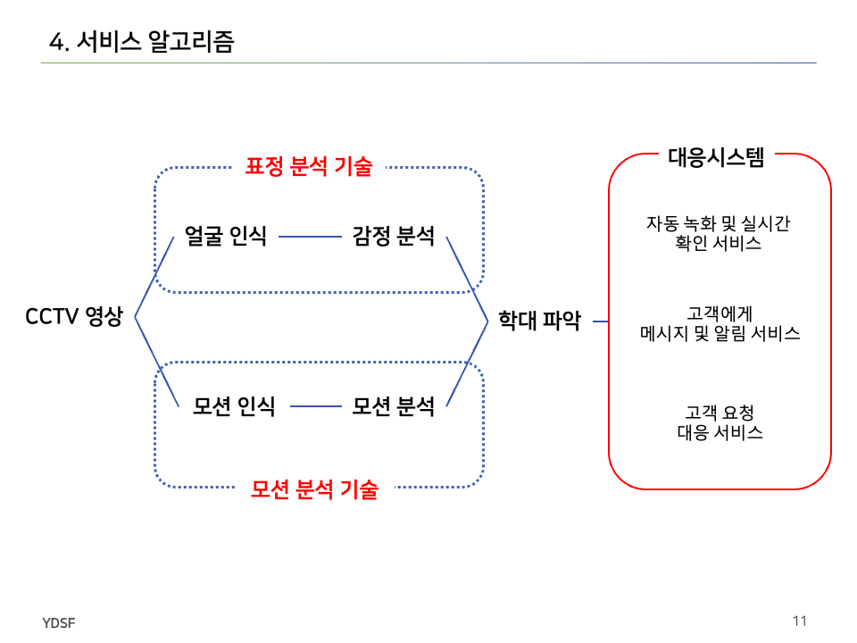

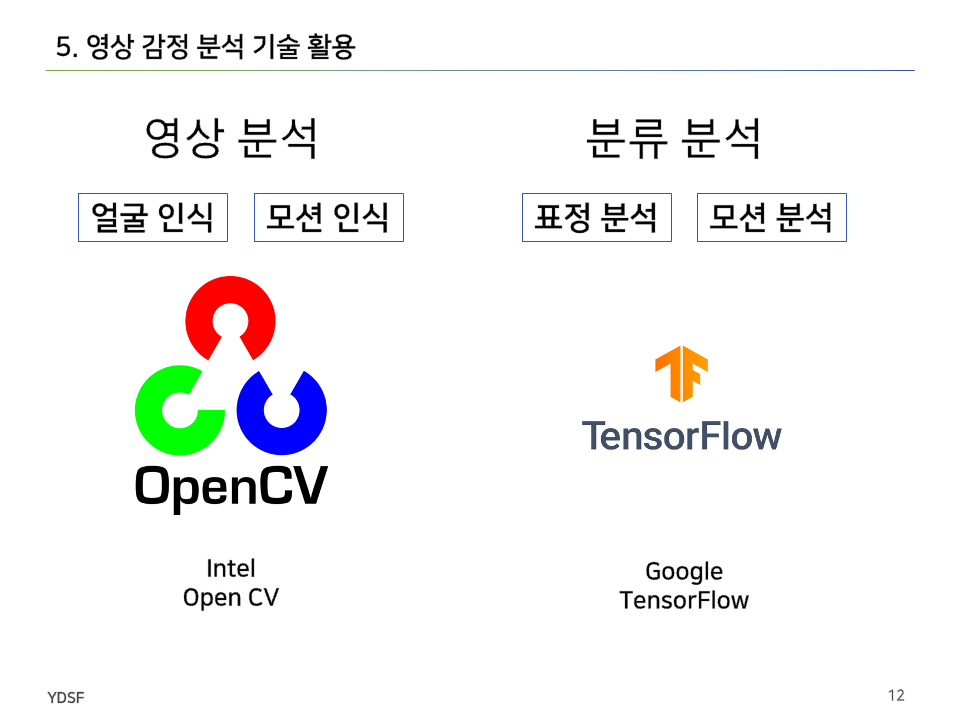

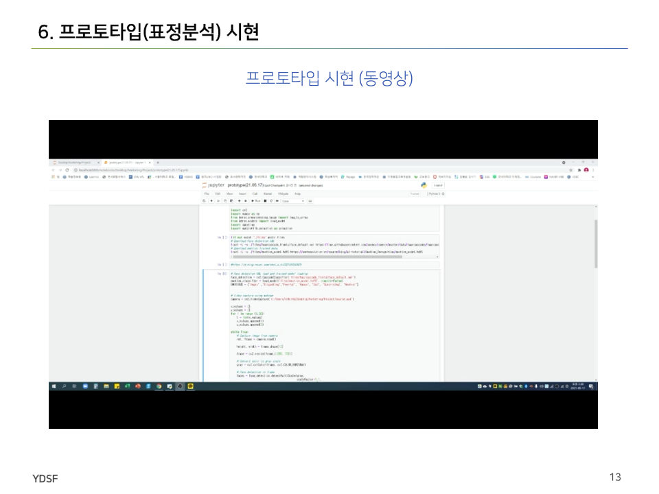

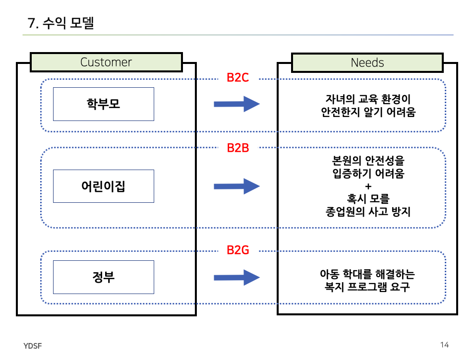

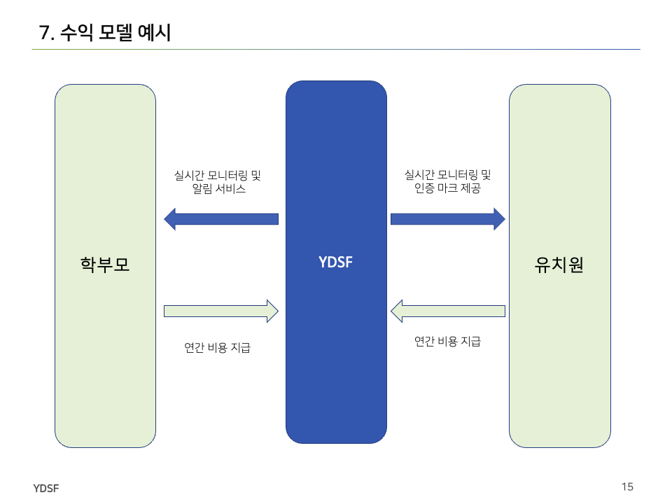

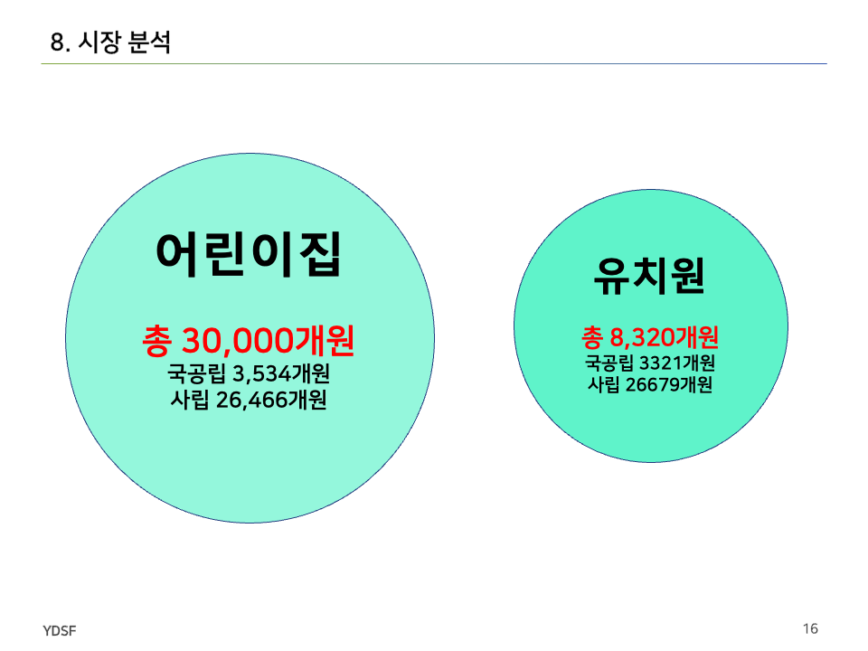

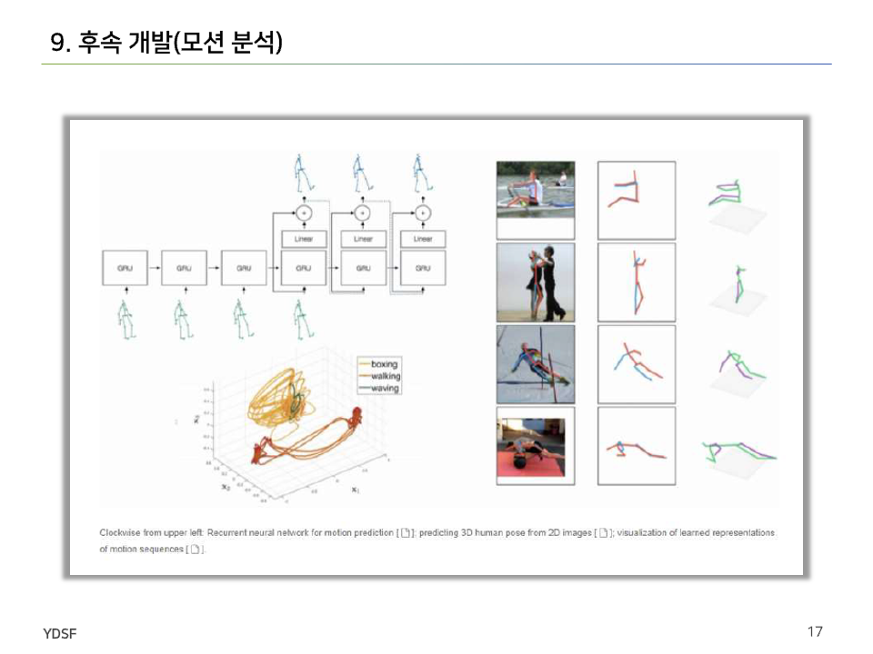

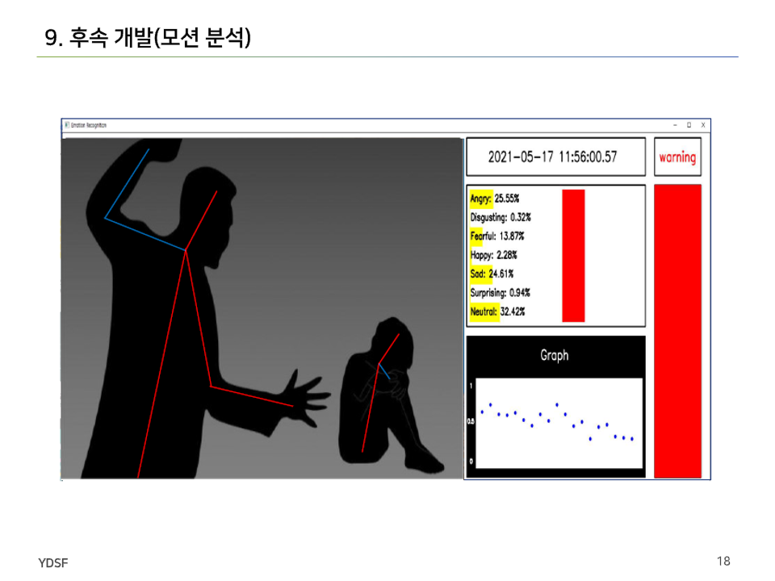
